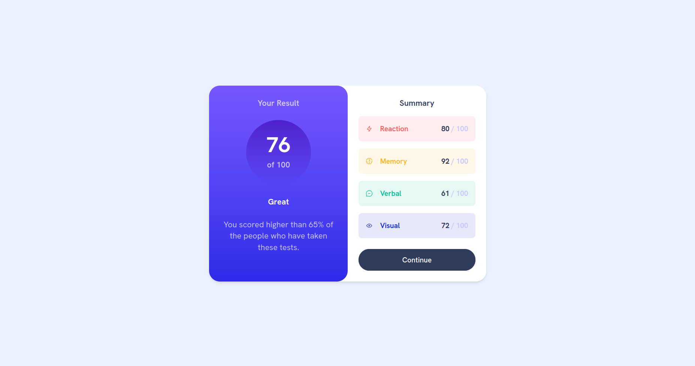

# Frontend Mentor - Results summary component solution

This is a solution to the [Results summary component challenge on Frontend Mentor](https://www.frontendmentor.io/challenges/results-summary-component-CE_K6s0maV). Frontend Mentor challenges help you improve your coding skills by building realistic projects.

## Table of contents

- [Overview](#overview)
  - [The challenge](#the-challenge)
  - [Screenshot](#screenshot)
  - [Links](#links)
- [My process](#my-process)
  - [Built with](#built-with)
- [Author](#author)

## Overview

### The challenge

Users should be able to:

- View the optimal layout for the interface depending on their device's screen size
- See hover and focus states for all interactive elements on the page

### Screenshot

### Links

- Solution URL: [Frontend mentor solution link](https://your-solution-url.com)
- Live Site URL: [Vercel link](https://results-summary-component-virid-tau.vercel.app/)

## My process

### Built with

- Semantic HTML5 markup
- CSS custom properties
- Flexbox
- CSS Grid
- Mobile-first workflow
- [Tailwind CSS](https://tailwindcss.com/) - For styles
- [Vite](https://vitejs.dev/) - For development and build process
- [React](https://reactjs.org/) - For building the UI
- [TypeScript](https://www.typescriptlang.org/) - For type safety and better development experience

### What I learned

This project helped me practice and improve my skills in React, TypeScript, and Tailwind CSS. I learned how to structure a React application with TypeScript for type safety and how to use Tailwind CSS for styling components efficiently.

## Author

- Frontend Mentor - [@Mohammed-Nedjima](https://www.frontendmentor.io/profile/Mohammed-Nedjima)
- linkedIn - [Mohammed Nedjima](https://www.linkedin.com/in/mohammed-ayoub-nedjima/)
